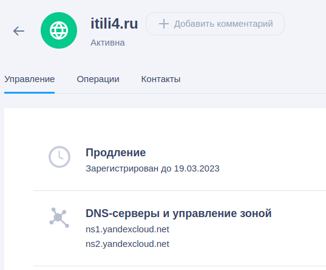
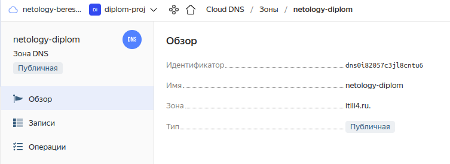
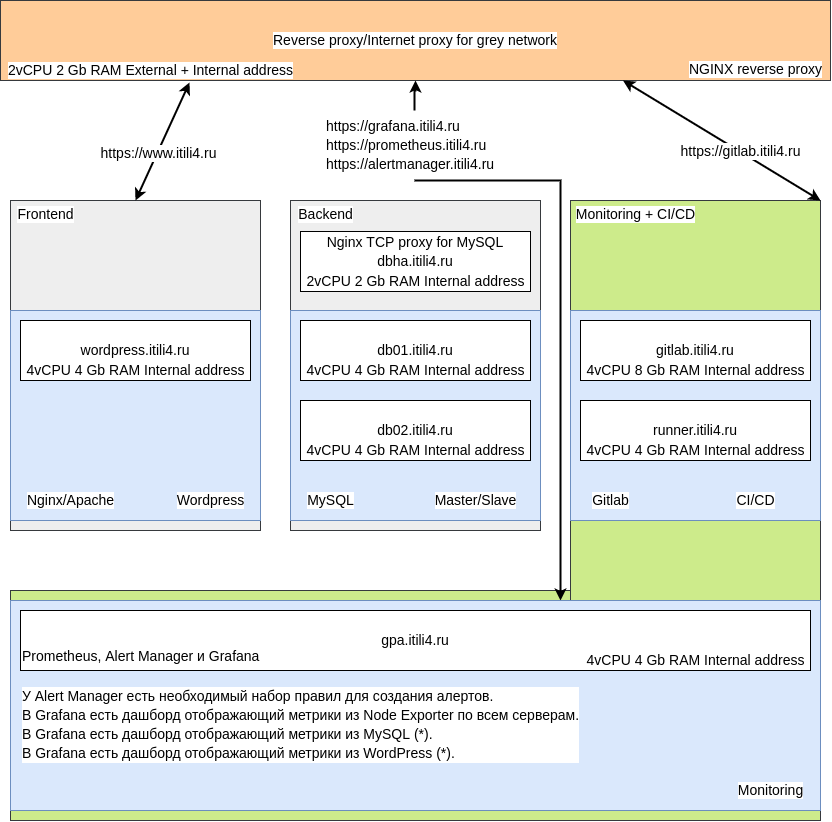
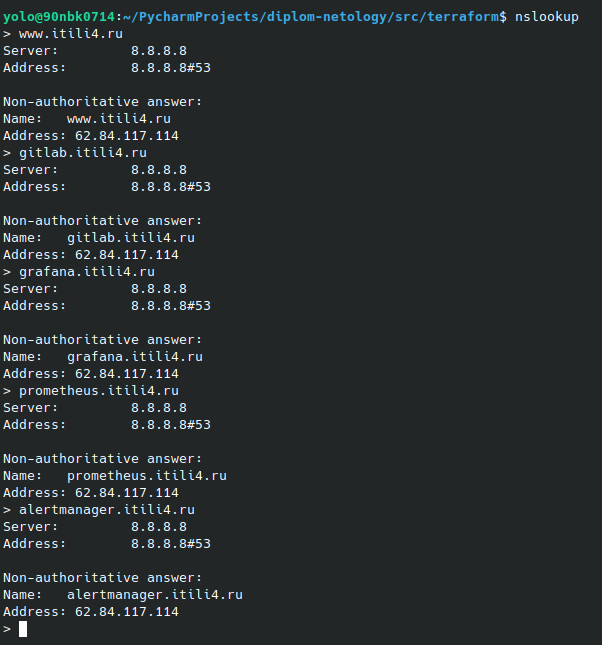
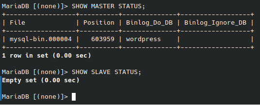
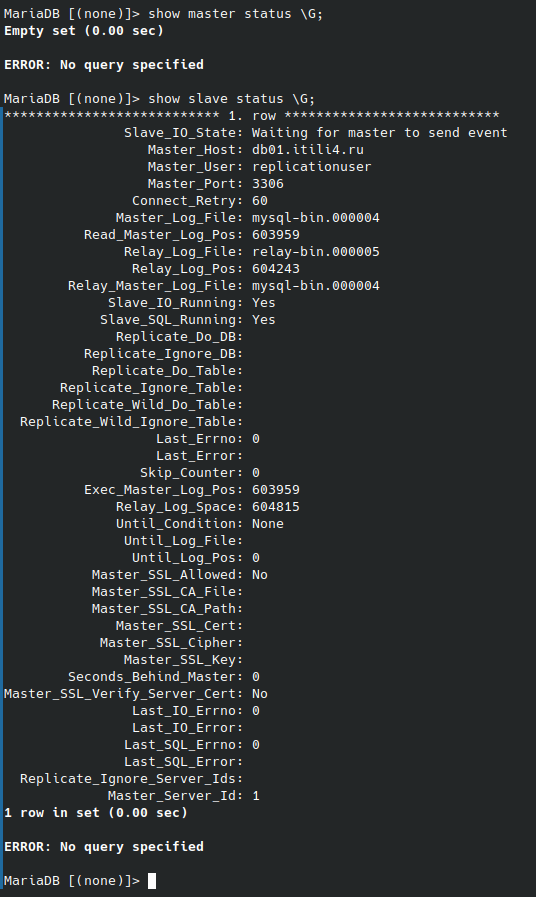
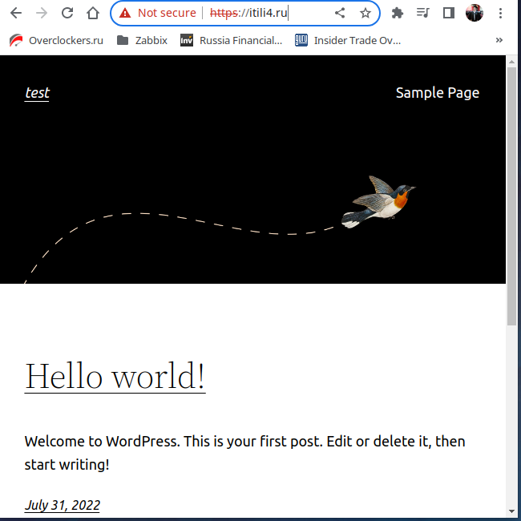

# diplom-netology

Дипломный практикум в YandexCloud

Цели:
1) Зарегистрировать доменное имя (любое на ваш выбор в любой доменной зоне). 
2) Подготовить инфраструктуру с помощью Terraform на базе облачного провайдера YandexCloud.
3) Настроить внешний Reverse Proxy на основе Nginx и LetsEncrypt.
4) Настроить кластер MySQL.
5) Установить WordPress.
6) Развернуть Gitlab CE и Gitlab Runner. Настроить CI/CD для автоматического развёртывания приложения.
7) Настроить мониторинг инфраструктуры с помощью стека: Prometheus, Alert Manager и Grafana.

Этапы выполнения:

# 1. Регистрация доменного имени 

Зарегистрировано доменное имя ITILI4.RU у регистратора reg.ru, управление DNS зоной делегировано в Яндекс CloudDNS.   
  
Необходимо для автоматизации управления DNS записями зоны.  
  

# 2. Создание инфраструктуры

Для начала необходимо подготовить инфраструктуру в YC при помощи Terraform.

Особенности выполнения:

Бюджет купона ограничен, что следует иметь в виду при проектировании инфраструктуры и использовании ресурсов;
Следует использовать последнюю стабильную версию Terraform.
Предварительная подготовка:

Создайте сервисный аккаунт, который будет в дальнейшем использоваться Terraform для работы с инфраструктурой с необходимыми и достаточными правами. Не стоит использовать права суперпользователя
Подготовьте backend для Terraform:
а. Рекомендуемый вариант: Terraform Cloud
б. Альтернативный вариант: S3 bucket в созданном YC аккаунте.

Настройте workspaces
а. Рекомендуемый вариант: создайте два workspace: stage и prod. В случае выбора этого варианта все последующие шаги должны учитывать факт существования нескольких workspace.
б. Альтернативный вариант: используйте один workspace, назвав его stage. Пожалуйста, не используйте workspace, создаваемый Terraform-ом по-умолчанию (default).

Создайте VPC с подсетями в разных зонах доступности.
Убедитесь, что теперь вы можете выполнить команды terraform destroy и terraform apply без дополнительных ручных действий.
В случае использования Terraform Cloud в качестве backend убедитесь, что применение изменений успешно проходит, используя web-интерфейс Terraform cloud.
Цель:

Повсеместно применять IaaC подход при организации (эксплуатации) инфраструктуры.
Иметь возможность быстро создавать (а также удалять) виртуальные машины и сети. С целью экономии денег на вашем аккаунте в YandexCloud.
Ожидаемые результаты:

Terraform сконфигурирован и создание инфраструктуры посредством Terraform возможно без дополнительных ручных действий.
Полученная конфигурация инфраструктуры является предварительной, поэтому в ходе дальнейшего выполнения задания возможны изменения.

## Итоговая схема инфраструктуры
Пришел к ней после выполнения всех этапов работы, некоторые конфигурации были изменены(Увеличил RAM у GitlabServer), добавил сервер dbha.itili4.ru для переключения нагрузку в случае падения основного сервера кластера MySQL.  
  
В качестве backend для terraform использовал S3 bucket в YandexCloud.

# 3. Установка Nginx и LetsEncrypt  
  
## Роль для установки Nginx и LetsEncrypt называется install-nginxrevproxy  
А-записи доменов создаются при развертывания инфраструктуры, т.к. наполнением ДНС-зоны занимается terraform. DNS-зона делегирована и развернута в YandexCloud как отдельный сервис.  
   
В процессе установки роль настраивает Selinux, подключаем необходимый репозиторий, устанавливает пакеты для Nginx.  
Выполняет копирование шаблонов конфигураций виртуальных хостов и наполняет их данными из переменных.  
Выполняет получение сертификатов с LetsEncrypt.  
Для демонстрации работы тестовых сертифкатов и перенаправление использовал curl.  
`curl -L -v -k --max-redirs 1 www.itili4.ru` Необходима и достаточная часть лога вывода представлена в [файле](rawoutput/testWWWredirect.txt)  
Первая часть демонстрирует работу с TLS(ключ -k у curl разрешает работать с не доверенными сертификатами), вторая часть содержит начальную страницу загрузки движка Wordpress.  

Основные возникшние проблемы при выполнения описанного этапа возникли из-за незнания принципов работы Selinux, по мере выполнения дипломной работы становилось понятней, очень помогает audit.log и google.   
# 4. Установка кластера MySQL
## Роль для установки и настройки кластера MySQL называется [install-mysql-service](src/ansible/roles/install-mysql-service/README.md)

Роля сначала выполняет базовую настройку устновку и настройку сервиса.
Создает пользователей для работы с бд и для репликации.
Далее, создаем базу данных, назначаем пользователям права для работы с ней и настраиваем возможность доступа к серверу БД из вне.
Далее, добавлям базу данных в репликацию и запускаем её. Проверяем, что репликация запустилась и работает.

Кластер из MySQL собирал в первый раз, до этого работал только с кластерными конфигурациями PostgreSQL и MS SQL.
Пришлось также повозиться с Selinux и корректной раздачей прав.

Скриншоты демонстрации успешного выполнения роли.
Мастер сервер  
 
Ведомый сервер  
   
# 5. Установка WordPress
## Роль для установки и настройки Wordpress [install-wordpress](src/ansible/roles/install-wordpress/README.md)
В качестве WEB-сервера для разнообразия выбрал Apache(в работе думаю так делать не стоит, надо использовать то что ВСЕ умеют лучше всего устанавливать и поддерживать. Зоопарк из используемых сервисов должен быть контроллируемый, а его размер необходимый и достаточный).
Роль устанавливает необходимые пакеты для Web-server Apache, далее подключаем дополнительный репозиторий для нужной версии PHP(в моем случае 7.4), в стандартном репозитории Centos 7 была только 5ая версия PHP.
Далее настраиваем VHOSTS для работы с сайтом, создаем необходимые папки(корень сайта и папка с логами).
Далее скачиваем и устанавливаем Wordpress, заменяем файл WP-CONFIG.php на наш, преднастроенный файл для созданной инфраструктуры.

Далее уже руками заходим через бразуер и проверяем что сайт открывается корректно и ошибок нет. 
   
На этом этапе Selinux был очень против переноса каталога с лог-файлами в другое место.

# 6. Установка Gitlab CE и Gitlab Runner

Необходимо настроить CI/CD систему для автоматического развертывания приложения при изменении кода.

Рекомендации:

• Имена серверов: gitlab.you.domain и runner.you.domain
• Характеристики: 4vCPU, 4 RAM, Internal address.

Цель:

Построить pipeline доставки кода в среду эксплуатации, то есть настроить автоматический деплой на сервер app.you.domain при коммите в репозиторий с WordPress.
Подробнее о Gitlab CI
Ожидаемый результат:

Интерфейс Gitlab доступен по https.
В вашей доменной зоне настроена A-запись на внешний адрес reverse proxy:
https://gitlab.you.domain (Gitlab)
На сервере you.domain отредактирован upstream для выше указанного URL и он смотрит на виртуальную машину на которой установлен Gitlab.
При любом коммите в репозиторий с WordPress и создании тега (например, v1.0.0) происходит деплой на виртуальную машину.
## 1 Заходи в гитлаб и создаем пустой репозиторий.
## 2 Загружаем содержимое развернутого сайта в пустой репозиторий.
## 3 Настраиваем Pipeline для передачи изменений на хостинг при коммите с тегом.
## 4 Делаем коммит без тега через GUI Gitlab, убеждаемся что pipeline не запустился.
## 5 Делаем новый коммти с тегом или назначем тег на прошлый коммит, убеждаемся что pipeline запустился.
Заходим на хостинг проверяем наличие изменений.

# 7. Установка Prometheus, Alert Manager, Node Exporter и Grafana

Необходимо разработать Ansible роль для установки Prometheus, Alert Manager и Grafana.

Рекомендации:

• Имя сервера: monitoring.you.domain
• Характеристики: 4vCPU, 4 RAM, Internal address.

Цель:

Получение метрик со всей инфраструктуры.
Ожидаемые результаты:

Интерфейсы Prometheus, Alert Manager и Grafana доступены по https.
В вашей доменной зоне настроены A-записи на внешний адрес reverse proxy:
• https://grafana.you.domain (Grafana)
• https://prometheus.you.domain (Prometheus)
• https://alertmanager.you.domain (Alert Manager)
На сервере you.domain отредактированы upstreams для выше указанных URL и они смотрят на виртуальную машину на которой установлены Prometheus, Alert Manager и Grafana.
На всех серверах установлен Node Exporter и его метрики доступны Prometheus.
У Alert Manager есть необходимый набор правил для создания алертов.
В Grafana есть дашборд отображающий метрики из Node Exporter по всем серверам.
В Grafana есть дашборд отображающий метрики из MySQL (*).
В Grafana есть дашборд отображающий метрики из WordPress (*).
Примечание: дашборды со звёздочкой являются опциональными заданиями повышенной сложности их выполнение желательно, но не обязательно.

Что необходимо для сдачи задания?

Репозиторий со всеми Terraform манифестами и готовность продемонстрировать создание всех ресурсов с нуля.
Репозиторий со всеми Ansible ролями и готовность продемонстрировать установку всех сервисов с нуля.
Скриншоты веб-интерфейсов всех сервисов работающих по HTTPS на вашем доменном имени.
https://www.you.domain (WordPress)
https://gitlab.you.domain (Gitlab)
https://grafana.you.domain (Grafana)
https://prometheus.you.domain (Prometheus)
https://alertmanager.you.domain (Alert Manager)
Все репозитории рекомендуется хранить на одном из ресурсов (github.com или gitlab.com).