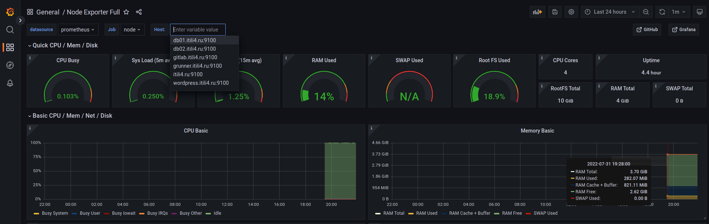
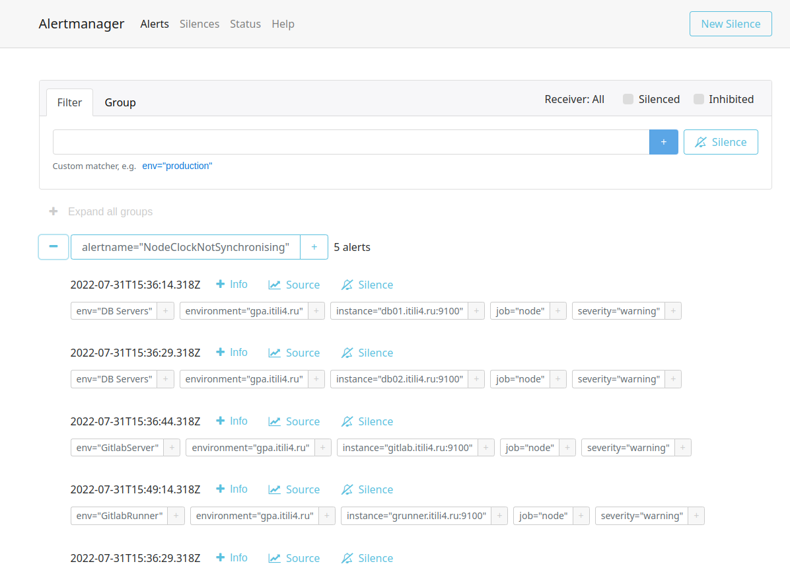

# diplom-netology

Дипломный практикум в YandexCloud

Цели:
1) Зарегистрировать доменное имя (любое на ваш выбор в любой доменной зоне). 
2) Подготовить инфраструктуру с помощью Terraform на базе облачного провайдера YandexCloud.
3) Настроить внешний Reverse Proxy на основе Nginx и LetsEncrypt.
4) Настроить кластер MySQL.
5) Установить WordPress.
6) Развернуть Gitlab CE и Gitlab Runner. Настроить CI/CD для автоматического развёртывания приложения.
7) Настроить мониторинг инфраструктуры с помощью стека: Prometheus, Alert Manager и Grafana.

Этапы выполнения:

# 1. Регистрация доменного имени 

Зарегистрировано доменное имя ITILI4.RU у регистратора reg.ru, управление DNS зоной делегировано в Яндекс CloudDNS.   
<p align="center"><br>  

Необходимо для автоматизации управления DNS записями зоны.<br>

<p align="center"> <br>  

# 2. Создание инфраструктуры

Для начала необходимо подготовить инфраструктуру в YC при помощи Terraform.

Особенности выполнения:

Бюджет купона ограничен, что следует иметь в виду при проектировании инфраструктуры и использовании ресурсов;
Следует использовать последнюю стабильную версию Terraform.
Предварительная подготовка:

Создайте сервисный аккаунт, который будет в дальнейшем использоваться Terraform для работы с инфраструктурой с необходимыми и достаточными правами. Не стоит использовать права суперпользователя
Подготовьте backend для Terraform:
а. Рекомендуемый вариант: Terraform Cloud
б. Альтернативный вариант: S3 bucket в созданном YC аккаунте.

Настройте workspaces
а. Рекомендуемый вариант: создайте два workspace: stage и prod. В случае выбора этого варианта все последующие шаги должны учитывать факт существования нескольких workspace.
б. Альтернативный вариант: используйте один workspace, назвав его stage. Пожалуйста, не используйте workspace, создаваемый Terraform-ом по-умолчанию (default).

Создайте VPC с подсетями в разных зонах доступности.
Убедитесь, что теперь вы можете выполнить команды terraform destroy и terraform apply без дополнительных ручных действий.
В случае использования Terraform Cloud в качестве backend убедитесь, что применение изменений успешно проходит, используя web-интерфейс Terraform cloud.
Цель:

Повсеместно применять IaaC подход при организации (эксплуатации) инфраструктуры.
Иметь возможность быстро создавать (а также удалять) виртуальные машины и сети. С целью экономии денег на вашем аккаунте в YandexCloud.
Ожидаемые результаты:

Terraform сконфигурирован и создание инфраструктуры посредством Terraform возможно без дополнительных ручных действий.
Полученная конфигурация инфраструктуры является предварительной, поэтому в ходе дальнейшего выполнения задания возможны изменения.

## Итоговая схема инфраструктуры
Пришел к ней после выполнения всех этапов работы, некоторые конфигурации были изменены(Увеличил RAM у GitlabServer), добавил сервер dbha.itili4.ru для переключения нагрузку в случае падения основного сервера кластера MySQL.  
<p align="center"> <br>  

В качестве backend для terraform использовал S3 bucket в YandexCloud.

# 3. Установка Nginx и LetsEncrypt  
  
## Роль для установки Nginx и LetsEncrypt называется install-nginxrevproxy  
А-записи доменов создаются при развертывания инфраструктуры, т.к. наполнением ДНС-зоны занимается terraform. DNS-зона делегирована и развернута в YandexCloud как отдельный сервис.  
<p align="center"> <br>  
В процессе установки роль настраивает Selinux, подключаем необходимый репозиторий, устанавливает пакеты для Nginx.  
Выполняет копирование шаблонов конфигураций виртуальных хостов и наполняет их данными из переменных.  
Выполняет получение сертификатов с LetsEncrypt.  
Для демонстрации работы тестовых сертифкатов и перенаправление использовал curl.  
`curl -L -v -k --max-redirs 1 www.itili4.ru` Необходима и достаточная часть лога вывода представлена в [файле](rawoutput/testWWWredirect.txt)  
Первая часть демонстрирует работу с TLS(ключ -k у curl разрешает работать с не доверенными сертификатами), вторая часть содержит начальную страницу загрузки движка Wordpress.  

Основные возникшние проблемы при выполнения описанного этапа возникли из-за незнания принципов работы Selinux, по мере выполнения дипломной работы становилось понятней, очень помогает audit.log и google.   
# 4. Установка кластера MySQL
## Роль для установки и настройки кластера MySQL называется [install-mysql-service](src/ansible/roles/install-mysql-service/README.md)

Роля сначала выполняет базовую настройку устновку и настройку сервиса.
Создает пользователей для работы с бд и для репликации.
Далее, создаем базу данных, назначаем пользователям права для работы с ней и настраиваем возможность доступа к серверу БД из вне.
Далее, добавлям базу данных в репликацию и запускаем её. Проверяем, что репликация запустилась и работает.

Кластер из MySQL собирал в первый раз, до этого работал только с кластерными конфигурациями PostgreSQL и MS SQL.
Пришлось также повозиться с Selinux и корректной раздачей прав.

Скриншоты демонстрации успешного выполнения роли.
Мастер сервер  
<p align="center"> <br> 

Ведомый сервер  
<p align="center"> <br>   

# 5. Установка WordPress
## Роль для установки и настройки Wordpress [install-wordpress](src/ansible/roles/install-wordpress/README.md)
В качестве WEB-сервера для разнообразия выбрал Apache(в работе/production думаю так делать не стоит, надо использовать то что ВСЕ умеют лучше всего устанавливать и поддерживать. Зоопарк из используемых сервисов должен быть контроллируемый, а его размер необходимый и достаточный).
Роль устанавливает необходимые пакеты для Web-server Apache, далее подключаем дополнительный репозиторий для нужной версии PHP(в моем случае 7.4), в стандартном репозитории Centos 7 была только 5ая версия PHP.
Далее настраиваем VHOSTS для работы с сайтом, создаем необходимые папки(корень сайта и папка с логами).
Далее скачиваем и устанавливаем Wordpress, заменяем файл WP-CONFIG.php на наш, преднастроенный файл для созданной инфраструктуры.

Далее уже руками заходим через бразуер и проверяем что сайт открывается корректно и ошибок нет. 
<p align="center"> <br>  

На этом этапе Selinux был очень против переноса каталога с лог-файлами в другое место.


# 6. Установка Gitlab CE и Gitlab Runner
## Роль для установки и настройки Gitlab CE называется [install-gitlab](src/ansible/roles/install-gitlab/README.md)
Роль добавляет необходимый репозиторий, устанавливает требуемые пакеты, копирует преднастроенный шаблон и заполняется данными из переменных.
Далее перезапускаем сервис для принятия параметров из конфигурационного файла.
Логин, пароль от учетной записи root и token для регистрации runner'а заранее предопределены в переменных.
Для стабильной работы сервиса потребовалось увеличение оперативной памяти до 8Gb.

## Роль для установки и настройки Gitlab CE Runner называется [install-grunner](src/ansible/roles/install-grunner/README.md)
Роль добавляет необходимый репозиторий, устанавливает требуемые пакеты, создает преднастроенный шаблон конфигурационного файла и заполняется данными из переменных.
Для регистрации runner использует token переданные ему в переменной, который предварительно был определен при конфигурировании сервера Gitlab CE.
Все прошло успешно, в WEB-интерфейсе Gitlab CE можно увидеть зарегистрированный Runner.

## CI/CD Pipeline [install-rsync](src/ansible/roles/install-rsyncserver/README.md)
Шаги для реализации pipeline:
0) Для корректной работы Pipeline в части передачи кода из репозитория через runner, необходимо дополнительно установить на application-server(WordPress) Rsync-сервис, с преднастроенной точкой обмена. На Gitlab runner устанавливает клиентскую часть. Все манипуляции выполняются одной ролью, логика работы зависит от имени сервера на котором была запущена роль.
1) Создаем репозиторий для проекта. Заходим в веб-часть Gitlab и создаем новый репозиторий "Wordpress"
2) Заходим на application-server в корневую директорию сайта, инициализируем git внутри кореневого каталога, настраиваем локальный репозиторий согласно инструкции полученной от Gitlab при создании пустого репозитория. Делаем первый коммит, если все прошло успешно то в веб-части Gitlab появится файлы из директории сайта.
3) Создаем CI/CD Pipeline в Gitlab. В интерфейсе Gitlab выбираем CI/CD->Editor, нам предлагают создать ".gitlab-ci.yml". Файл в котором и будет храниться код CI/CD текущего проекта.
4) Заменяем содержимое шаблонного файла нашим кодом.
```yaml
variables:
  GIT_STRATEGY: clone

stages:          
 - deploy

tag-job:
  stage: deploy
  rules:
    - if: '$CI_COMMIT_TAG != null'
  script:
    - echo $CI_RSYNC_PASS > /home/gitlab-runner/rsyncd.scrt
    - chmod 600 /home/gitlab-runner/rsyncd.scrt
    - rsync -rult --password-file=/home/gitlab-runner/rsyncd.scrt --exclude '.*' $CI_PROJECT_DIR/ grunner@wordpress.itili4.ru::www
    - rm /home/gitlab-runner/rsyncd.scrt
```
Делаем commit и сохраняем получившийся файл в репозиторий с проектом, теперь Gitlab CI/CD будет знать что и когда ему делать, Auto DevOps, вмешиваться больше не должен.
Создаем пременную окружения `$CI_RSYNC_PASS` т.к. она определена нами и не содержится в стандартных переменных Gitlab.
Переходим в Settings->CI/CD->Variables, создаем новую переменную и снимаем флажки. Я в первый раз их не снял и получил ошибку, так как pipeline не смог получить доступ к переменной.
6) Pipeline ГОТОВ!

Проверяем...
1) Создаем пустой файл в репозитории проекта через web-ide gitlaba(так быстрее всего), пишем в него одну строчку, делаем коммит. 
2) Идем смотреть появились ли новые Job или был ли запущен pipeline. Ничего не сработало, значит пока все в порядке.
3) Вносим изменения в файл, доабвляем вторую строчку, делаем коммит, делает тег на коммит.
4) Идем проверять новые job. Видимо что появились новые job на тегированном коммите, значит все работает...
5) Идем проверять директорию. Зайдем в прошлое и получим скриншот того что было то тегированного коммита
Нового файла нет
Идем в настоящее
Файл есть, содержимое совпадает. Теперь точно все работает.


 

# 7. Установка Prometheus, Alert Manager, Node Exporter и Grafana
## Роль для установки и настройки Node Exporter [install-node_exporter](src/ansible/roles/install-node-exporter/README.md)
Роль скачивает с репозитория указанную версию дистрибутива, распаковывает во временную папку, раскладывает исполняемые файлы, заполняет конфигурационный файл шаблона из переменных и создаем systemd файл для удобного управления сервисом, в окончании проверяем что служба работает и открыт нужный порт.
## Роль для установки и настройки Prometheus [install-prometheus](src/ansible/roles/install-prometheus/README.md)
Роль скачивает с репозитория указанную версию дистрибутива, распаковывает во временную папку, раскладывает исполняемые файлы, заполняет конфигурационный файл шаблона(Указываем точки сбора трафика, описываем алерты и куда отправлять алерты) из переменных и создаем systemd файл для удобного управления сервисом. 
<p align="center"> <br>  

## Роль для установки и настройки Grafana [install-grafana](src/ansible/roles/install-grafana/README.md)
Роль скачивает с репозитория указанную версию дистрибутива, распаковывает во временную папку, раскладывает исполняемые файлы, заполняет конфигурационный файл шаблона(Данные учетной записи для входа и источники данных) из переменных и создаем systemd файл для удобного управления сервисом.
Дополнительно загружаем шаблон для демонстрации данных Node Exporter, шаблон передаем файлово т.к. загрузка из центрального репозитория Grafana не работает/временно не работает из YandexCloud...
<p align="center"> <br>  

## Роль для установки и настройки Alert Manager [install-alertmanager](src/ansible/roles/install-alertmanager/README.md)
Роль скачивает с репозитория указанную версию дистрибутива, распаковывает во временную папку, раскладывает исполняемые файлы, заполняет конфигурационный файл шаблона из переменных и создаем systemd файл для удобного управления сервисом, в окончании проверяем что служба работает и открыт нужный порт. 
Дополнительно передаем параметры доставка оповещений о сработке алертов.
<p align="center"> <br>  


Что необходимо для сдачи задания?

Репозиторий со всеми Terraform манифестами и готовность продемонстрировать создание всех ресурсов с нуля.
Репозиторий со всеми Ansible ролями и готовность продемонстрировать установку всех сервисов с нуля.
Скриншоты веб-интерфейсов всех сервисов работающих по HTTPS на вашем доменном имени.
https://www.you.domain (WordPress)
https://gitlab.you.domain (Gitlab)
https://grafana.you.domain (Grafana)
https://prometheus.you.domain (Prometheus)
https://alertmanager.you.domain (Alert Manager)
Все репозитории рекомендуется хранить на одном из ресурсов (github.com или gitlab.com).