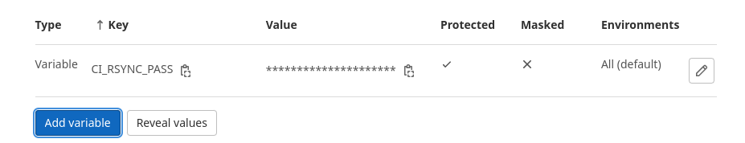

# diplom-netology

Дипломный практикум в YandexCloud

Цели:
1) Зарегистрировать доменное имя (любое на ваш выбор в любой доменной зоне). 
2) Подготовить инфраструктуру с помощью Terraform на базе облачного провайдера YandexCloud.
3) Настроить внешний Reverse Proxy на основе Nginx и LetsEncrypt.
4) Настроить кластер MySQL.
5) Установить WordPress.
6) Развернуть Gitlab CE и Gitlab Runner. Настроить CI/CD для автоматического развёртывания приложения.
7) Настроить мониторинг инфраструктуры с помощью стека: Prometheus, Alert Manager и Grafana.

Этапы выполнения:

# 1. Регистрация доменного имени 

Зарегистрировано доменное имя ITILI4.RU у регистратора reg.ru, управление DNS зоной делегировано в Яндекс CloudDNS.   
<p align="center"><br>  

Необходимо для автоматизации управления DNS записями зоны.<br>

<p align="center"> <br>  

# 2. Создание инфраструктуры

Для создания инфраструктуры использовал Terraform, в качестве backend S3 хранилище от YandexCloud. Создал два workspace prod и stage.  
Все инфраструктура выполняется от роли сервисного аккаунта с достаточным количеством привилегий.  
<p align="center"> <br> 
<p align="center"> <br> 

Отличия в workspace:  
1) Имена виртуальных машин(не hostname) в панели управления указываются с учетом workspace в котором они созданы.  
2) Мощность(системные требования) создаваемых виртуальных машин не для prod workspace уменьшены в 2 раза, там где это возможно.  
3) В prod workspace виртуальные машины создаются с параметрами запрещающим их остановку по желанию YandexCloud. В stage этот параметр разрешен, т.к. время жизни виртуальных машин значительно меньше чем в prod, дополнительно это опция экономит баланс.  
Скриншот с примером prod workspace.  
<p align="center"> <br> 

Ниже представлен листинг файла terraform variables.tf определяем переменные используемые во всей инфраструктуре.  
```yaml
variable "yandex_cloud_id" {
  default = "b1ghoagi59974h152cps"
}

variable "yandex_folder_id" {
  default = "b1g5mpl5ths26blfceli"
}
# ID можно узнать с помощью команды yc compute image list
variable "centos-7-base" {
  default = "fd88d14a6790do254kj7"
}

variable "dns_zone_id" {
  default = "dns0i82057c3jl8cntu6"
}

```
Ниже представлен листинг файла terraform provider.tf определяем какой провайдер для YandexCloud используем, как попасть в S3 bucket, и ключи доступа для работы от имени сервисного аккаунта.  
```yaml
terraform {
  required_providers {
    yandex = {
      source = "yandex-cloud/yandex"
    }
  }

  backend "s3" {
    endpoint   = "storage.yandexcloud.net"
    bucket     = "diplom-bucket"
    region     = "ru-central1"
    key        = "terraform/terraform.tfstate"
    access_key = "YCAJELZI5zOAW2vJTgDV7UUbc"
    secret_key = "YCN8WGUE6cFjxTVG2TgHsEhn_3ZC7xMw3HssOCNz"

    skip_region_validation      = true
    skip_credentials_validation = true
  }
}

provider "yandex" {
  service_account_key_file = "key.json"
  cloud_id  = "${var.yandex_cloud_id}"
  folder_id = "${var.yandex_folder_id}"
}
```
Файл inventory для Ansible формирует terraform после создания инфраструктуры, листинг файла inventory.tf
```yaml
resource "local_file" "inventory" {
  content = <<-DOC
    [nodes:children]
    frontend
    dbservers
    glservers
    runnerservers
    gpaservers
    dbha

    [reversproxy]
    rproxy.itili4.ru ansible_host=${yandex_compute_instance.rproxy.network_interface.0.nat_ip_address}
    [frontend]
    wordpress.itili4.ru ansible_host=${yandex_compute_instance.wordpress.network_interface.0.ip_address}
    [dbservers]
    db01.itili4.ru ansible_host=${yandex_compute_instance.db01.network_interface.0.ip_address}
    db02.itili4.ru ansible_host=${yandex_compute_instance.db02.network_interface.0.ip_address}
    [glservers]
    gitlab.itili4.ru ansible_host=${yandex_compute_instance.gitlab.network_interface.0.ip_address}
    [runnerservers]
    grunner.itili4.ru ansible_host=${yandex_compute_instance.grunner.network_interface.0.ip_address}
    [gpaservers]
    gpa.itili4.ru ansible_host=${yandex_compute_instance.gpa.network_interface.0.ip_address}
    [dbha]
    dbha.itili4.ru ansible_host=${yandex_compute_instance.dbha.network_interface.0.ip_address}

    [nodes:vars]
    ansible_ssh_common_args='-o StrictHostKeyChecking=no -o UserKnownHostsFile=/dev/null -o ProxyCommand="ssh -W %h:%p -q centos@${yandex_compute_instance.rproxy.network_interface.0.nat_ip_address}"'
    ansible_ssh_user=centos
  
    [reversproxy:vars]
    ansible_ssh_common_args='-o StrictHostKeyChecking=no'
    ansible_ssh_user=centos
    ansible_ssh_private_key_file=/home/yolo/.ssh/id_rsa
    DOC
  filename = "../ansible/inventory"

  depends_on = [
    yandex_compute_instance.rproxy,
    yandex_compute_instance.db01,
    yandex_compute_instance.db02,
    yandex_compute_instance.dbha,
    yandex_compute_instance.gitlab,
    yandex_compute_instance.grunner,
    yandex_compute_instance.gpa
  ]
}
```
Для удоства работы с инфраструктурой и provisioning создал alias.  
```bash
alias tera="terraform apply --auto-approve"
alias terd="terraform destroy --auto-approve"
alias terprov="ansible-playbook -i /home/yolo/PycharmProjects/diplom-netology/src/ansible/inventory /home/yolo/PycharmProjects/diplom-netology/src/ansible/mainplaybook.yml"
```
  
## Итоговая схема инфраструктуры
Пришел к ней после выполнения всех этапов работы, некоторые конфигурации были изменены(Увеличил RAM у GitlabServer), добавил сервер dbha.itili4.ru для переключения нагрузку в случае падения основного сервера кластера MySQL.  
<p align="center"> <br>  

# 3. Установка Nginx и LetsEncrypt  
  
## Роль для установки Nginx и LetsEncrypt называется install-nginxrevproxy  
А-записи доменов создаются при развертывания инфраструктуры, т.к. наполнением ДНС-зоны занимается terraform. DNS-зона делегирована и развернута в YandexCloud как отдельный сервис.  
<p align="center"> <br>  

В процессе установки роль настраивает Selinux, подключаем необходимый репозиторий, устанавливает пакеты для Nginx.  
Выполняет копирование шаблонов конфигураций виртуальных хостов и наполняет их данными из переменных.  
Выполняет получение сертификатов с LetsEncrypt.  
Получили сертификаты и проверили перенаправление.
<p align="center"> <br>  

Основные возникшие проблемы при выполнения описанного этапа возникли из-за незнания принципов работы Selinux, по мере выполнения дипломной работы становилось понятней, очень помогает audit.log и google.   
# 4. Установка кластера MySQL
## Роль для установки и настройки кластера MySQL называется [install-mysql-service](src/ansible/roles/install-mysql-service/README.md)

Роль сначала выполняет базовую настройку устновку и настройку сервиса.
Создает пользователей для работы с БД и для репликации.
Далее, создаем базу данных, назначаем пользователям права для работы с ней и настраиваем возможность доступа к серверу БД из вне.
Далее, добавляем базу данных в репликацию и запускаем её. Проверяем, что репликация запустилась и работает.

Кластер из MySQL собирал в первый раз, до этого работал только с кластерными конфигурациями PostgreSQL и MS SQL.
Пришлось также повозиться с Selinux и корректной раздачей прав.

Скриншоты демонстрации успешного выполнения роли.  
Мастер сервер  
<p align="center"> <br> 

Ведомый сервер  
<p align="center"> <br>   

## Роль для установки reverse proxy для Mysql Cluster. [install-mysql-service](src/ansible/roles/install-nginx-tcpproxy/README.md)
Роль как и дополнительный сервер необходимо реализовать, в противном случае при падении сервера прописанного в конфигурационном файле wp-config.php упадет и сайт, т.к. в качестве точки входа в базу данных указа Master-server т.к. только он доступен на запись.
Описанная роль создает обратный прокси для tcp-соединений, и следит за состоянием хостов backend. В случае падения основного сервера все запросы перейду на вторичный. Который в свою очередь, после падения основного, станет главным.
В процессе работы роли, устанавливается специальный пакет Nginx-mod-stream скомпилированный с дополнительным пакетом поддержки tcp-потоков. Конфигурационный файл копируется из шаблона.
# 5. Установка WordPress
## Роль для установки и настройки Wordpress [install-wordpress](src/ansible/roles/install-wordpress/README.md)
В качестве WEB-сервера для разнообразия выбрал Apache.
Роль устанавливает необходимые пакеты для Web-server Apache, далее подключаем дополнительный репозиторий для нужной версии PHP(в моем случае 7.4), в стандартном репозитории Centos 7 была только 5ая версия PHP.
Далее настраиваем VHOSTS для работы с сайтом, создаем необходимые папки(корень сайта и папка с логами).
Далее скачиваем и устанавливаем Wordpress, заменяем файл WP-CONFIG.php на наш, преднастроенный файл для созданной инфраструктуры.

Далее уже руками заходим через интернет-бразуер и проверяем что сайт открывается корректно и ошибок нет. 
<p align="center"> <br>  

На этом этапе Selinux был очень против переноса каталога с лог-файлами в другое место.


# 6. Установка Gitlab CE и Gitlab Runner
## Роль для установки и настройки Gitlab CE называется [install-gitlab](src/ansible/roles/install-gitlab/README.md)
Роль добавляет необходимый репозиторий, устанавливает требуемые пакеты, копирует преднастроенный шаблон и заполняется данными из переменных.
Далее перезапускаем сервис для принятия параметров из конфигурационного файла.
Логин, пароль от учетной записи root и token для регистрации runner'а заранее предопределены в переменных.
Для стабильной работы сервиса потребовалось увеличение оперативной памяти до 8Gb.

## Роль для установки и настройки Gitlab CE Runner называется [install-grunner](src/ansible/roles/install-grunner/README.md)
Роль добавляет необходимый репозиторий, устанавливает требуемые пакеты, создает преднастроенный шаблон конфигурационного файла и заполняется данными из переменных.
Для регистрации runner использует token переданные ему в переменной, который предварительно был определен при конфигурировании сервера Gitlab CE.
Все прошло успешно, в WEB-интерфейсе Gitlab CE можно увидеть зарегистрированный Runner.  

## CI/CD Pipeline [install-rsync](src/ansible/roles/install-rsyncserver/README.md)  
Шаги для реализации pipeline:  
0) Для корректной работы Pipeline в части передачи кода из репозитория через runner, необходимо дополнительно установить на application-server(WordPress) Rsync-сервис, с преднастроенной точкой обмена. На Gitlab runner устанавливает клиентскую часть. Все манипуляции выполняются одной ролью, логика работы зависит от имени сервера на котором была запущена роль.  
1) Создаем репозиторий для проекта. Заходим в веб-часть Gitlab и создаем новый репозиторий "Wordpress"  
<p align="center"> <br>  

2) Заходим на application-server в корневую директорию сайта, инициализируем git внутри кореневого каталога, настраиваем локальный репозиторий согласно инструкции полученной от Gitlab при создании пустого репозитория. Делаем первый коммит, если все прошло успешно то в веб-части Gitlab появится файлы из директории сайта.  
<p align="center"> <br> 

3) Создаем CI/CD Pipeline в Gitlab. В интерфейсе Gitlab выбираем CI/CD->Editor, нам предлагают создать ".gitlab-ci.yml". Файл в котором и будет храниться код CI/CD текущего проекта.  
4) Заменяем содержимое шаблонного файла нашим кодом.  
```yaml
variables:
  GIT_STRATEGY: clone

stages:          
 - deploy

tag-job:
  stage: deploy
  rules:
    - if: '$CI_COMMIT_TAG != null'
  script:
    - echo $CI_RSYNC_PASS > /home/gitlab-runner/rsyncd.scrt
    - chmod 600 /home/gitlab-runner/rsyncd.scrt
    - rsync -rult --password-file=/home/gitlab-runner/rsyncd.scrt --exclude '.*' $CI_PROJECT_DIR/ grunner@wordpress.itili4.ru::www
    - rm /home/gitlab-runner/rsyncd.scrt
```
<p align="center"> <br> 

Делаем commit и сохраняем получившийся файл в репозиторий с проектом, теперь Gitlab CI/CD будет знать что и когда ему делать, Auto DevOps, вмешиваться больше не должен.  
Создаем переменную окружения `$CI_RSYNC_PASS` т.к. она определена нами и не содержится в стандартных переменных Gitlab.  
Переходим в Settings->CI/CD->Variables, создаем новую переменную...  
<p align="center"> <br> 

...и снимаем флажки. Я в первый раз их не снял и получил ошибку, так как pipeline не смог получить доступ к переменной.  
<p align="center"> <br> 

6) Pipeline ГОТОВ!  

Проверяем...  
1) Создаем пустой файл в репозитории проекта через web-ide gitlab(так быстрее всего), пишем в него одну строчку, делаем коммит.  
2) Идем смотреть появились ли новые Job или был ли запущен pipeline. Ничего не сработало, значит пока все в порядке.  
3) Вносим изменения в файл, добавляем вторую строчку, делаем коммит, делает тег на коммит.  
<p align="center"> <br> 

4) Идем проверять новые job. Видим что появились новые job на тегированном коммите, значит все работает...  
<p align="center"> <br> 

5) Идем проверять директорию. Вернемся в прошлое и получим скриншот того что было до тегированного коммита  
<p align="center"> <br> 

Нового файла нет  
Идем в настоящее  
<p align="center"> <br> 

Файл есть, содержимое совпадает. Теперь точно все работает.  

# 7. Установка Prometheus, Alert Manager, Node Exporter и Grafana
## Роль для установки и настройки Node Exporter [install-node_exporter](src/ansible/roles/install-node-exporter/README.md)
Роль скачивает с репозитория указанную версию дистрибутива, распаковывает во временную папку, раскладывает исполняемые файлы, заполняет конфигурационный файл шаблона из переменных и создаем systemd файл для удобного управления сервисом, в окончании проверяем что служба работает и открыт нужный порт.
## Роль для установки и настройки Prometheus [install-prometheus](src/ansible/roles/install-prometheus/README.md)
Роль скачивает с репозитория указанную версию дистрибутива, распаковывает во временную папку, раскладывает исполняемые файлы, заполняет конфигурационный файл шаблона(Указываем точки сбора трафика, описываем алерты и куда отправлять алерты) из переменных и создаем systemd файл для удобного управления сервисом. 
<p align="center"> <br>  

## Роль для установки и настройки Grafana [install-grafana](src/ansible/roles/install-grafana/README.md)
Роль скачивает с репозитория указанную версию дистрибутива, распаковывает во временную папку, раскладывает исполняемые файлы, заполняет конфигурационный файл шаблона(Данные учетной записи для входа и источники данных) из переменных и создаем systemd файл для удобного управления сервисом.
Дополнительно загружаем шаблон для демонстрации данных Node Exporter, шаблон передаем файлово т.к. загрузка из центрального репозитория Grafana не работает/временно не работает из YandexCloud...
<p align="center"> <br>  

## Роль для установки и настройки Alert Manager [install-alertmanager](src/ansible/roles/install-alertmanager/README.md)
Роль скачивает с репозитория указанную версию дистрибутива, распаковывает во временную папку, раскладывает исполняемые файлы, заполняет конфигурационный файл шаблона из переменных и создаем systemd файл для удобного управления сервисом, в окончании проверяем что служба работает и открыт нужный порт. 
Дополнительно передаем параметры доставка оповещений о сработке алертов.
<p align="center"> <br>  

# Дополнительно  
# Реализовал сбор метрик с сайта Wordpress  
## Роль для сбора метрик [install-wordpressexporter](src/ansible/roles/install-wordpressexporter/README.md)  

Экспортер метрик написан на Golang, за метриками ходит прямо в MySQL в базу данных сайта.  
Вытаскивает данные по количестову зарегистрированных пользователей, количество постов, количество комментариев.  
Сбор метрик можно расширить при необходимости, дописав [скрипт](src/ansible/roles/install-wordpressexporter/files/wordpress_exporter.go) на Go.  

Дашбоард для Grafana устанавливается в роли по настройке Grafana, Job для Prometheus аналогично.  

Пример получаемых метрик через консоль:  
```bash
[root@itili4 centos]# curl http://wordpress.itili4.ru:8888/metrics | grep wp_
  % Total    % Received % Xferd  Average Speed   Time    Time     Time  Current
                                 Dload  Upload   Total   Spent    Left  Speed
100  6409    0  6409    0     0   566k      0 --:--:-- --:--:-- --:--:--  625k
# HELP wp_num_comments_metric Shows the number of total comments in the WordPress site
# TYPE wp_num_comments_metric counter
wp_num_comments_metric 1
# HELP wp_num_posts_metric Shows the number of total posts in the WordPress site
# TYPE wp_num_posts_metric counter
wp_num_posts_metric 1
# HELP wp_num_users_metric Shows the number of registered users in the WordPress site
# TYPE wp_num_users_metric counter
wp_num_users_metric 1
[root@itili4 centos]# 
```
Скриншоты интерфейса Grafan с нужным дашбородом. (Источник данных и запросы пришлось править руками в WEB, в дашбордах пока не силен...)  
<p align="center"> <br>  
